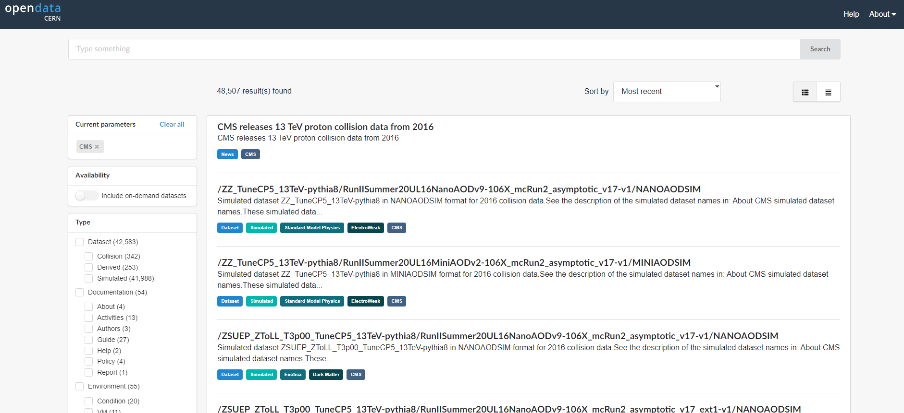

:::::: questions
- Where do I find datasets for data and Monte Carlo?

::::::::::::::::::::::

:::::: objectives
- Be able to find the data and Monte Carlo datasets

::::::::::::::::::::::

## CERN Open Data Portal

Our starting point is the landing page for [CERN Open Data Portal](http://opendata.cern.ch/).
You should definitely take some time to explore it. But for now we will select the 
CMS data. 

:::::: callout
## CERN Open Data Portal
The landing page for the [CERN Open Data Portal](http://opendata.cern.ch/).

::::::::::::::::::::::

:::::: prereq
## Make a selection!
Find the CMS link under **Focus on** and click on it. 
::::::::::::::::::::::

## CMS-specific datasets

The figure below shows the website after we have chosen the CMS data. Note the left-hand
sidebar that allows us to filter our selections. Let's see what's there. 

:::::: callout
## CERN Open Data Portal - CMS data
The first pass to filter on CMS data

::::::::::::::::::::::

At first glance we can see a few things. First, there is an option to select only **Dataset** rather 
than documentation or software or similar materials. Great! Going forward we'll select **Dataset**. 

Next, scrolling down to see the search options in the left bar, we see that there are a lot of entries for data from **2010**, **2011**, **2012**, **2015**, and **2016**, the 7 TeV, 8 TeV and 13 TeV running periods. 
We'll be working with 2016 data for these exercises. 

:::::: prereq
## Make a selection!
For the next episode, let's select **Dataset** and **2016**.  
::::::::::::::::::::::

:::::: keypoints
- Use the filter selections in the left-hand sidebar of the CERN Open Data Portal to find datasets.

::::::::::::::::::::::