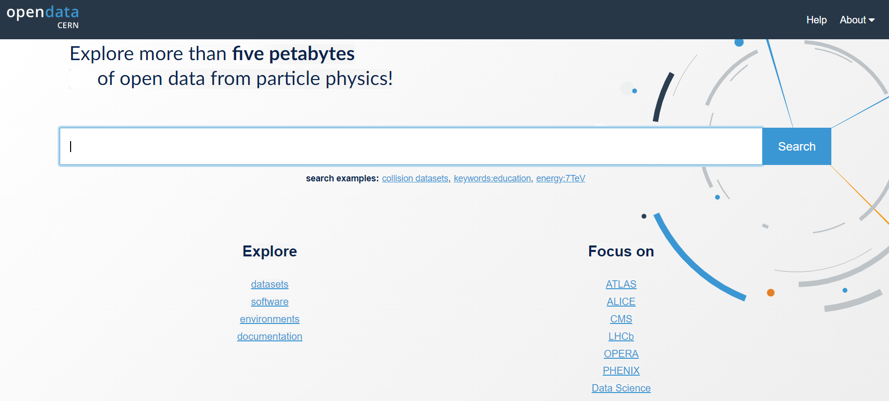

:::::: questions
- Where do I find datasets for data and Monte Carlo?

::::::::::::::::::::::

:::::: objectives
- Be able to find the data and Monte Carlo datasets

::::::::::::::::::::::

## CERN Open Data Portal

Our starting point is the landing page for [CERN Open Data Portal](http://opendata.cern.ch/).
You should definitely take some time to explore it. But for now we will select the 
CMS data. 

:::::: callout
## CERN Open Data Portal
The landing page for the [CERN Open Data Portal](http://opendata.cern.ch/).

<!-- 
This does not work as the deployment looks for it in
https://cms-opendata-workshop.github.io/workshopqcd-2024-lesson-dataset-scouting/files/portal_screenshot_landing_page.png
move to ../assets/img/ (No) or ../assets/images and see if a miracle happens... NO!
Under episodes/figures See https://github.com/carpentries/sandpaper, still no success
From none of these places does it deployed to the gh-pages branch from where the site is served.
Try episodes/fig as in https://github.com/carpentries/lesson-development-training/tree/main/episodes/fig
 -->
::::::::::::::::::::::

:::::: prereq
## Make a selection!
Find the CMS link under **Focus on** and click on it. 
::::::::::::::::::::::

:::::: keypoints
- Use the filter selections in the left-hand sidebar of the CERN Open Data Portal to find datasets.

::::::::::::::::::::::