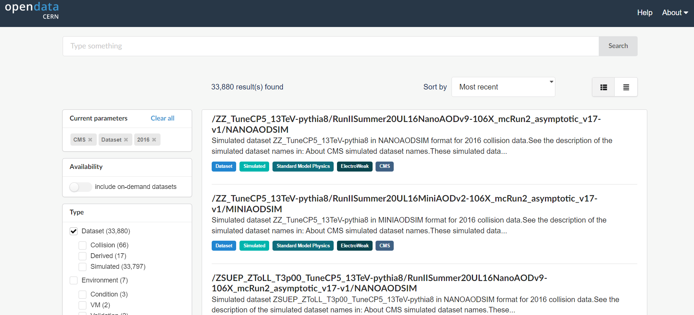
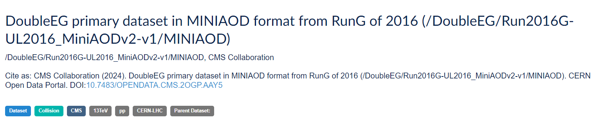
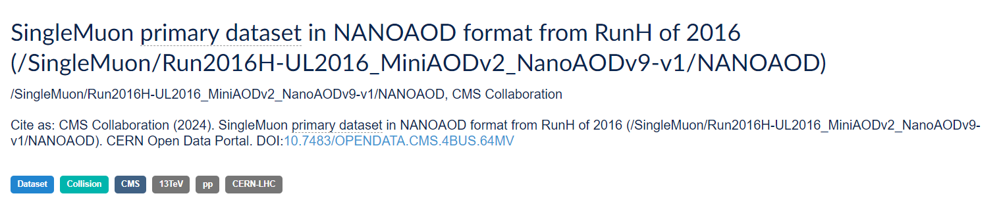
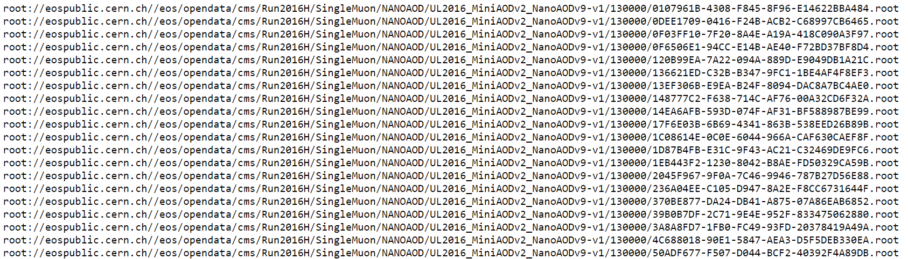
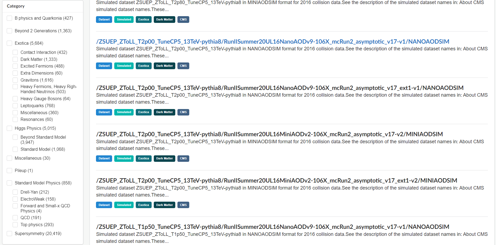
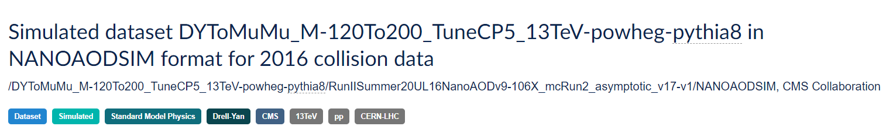
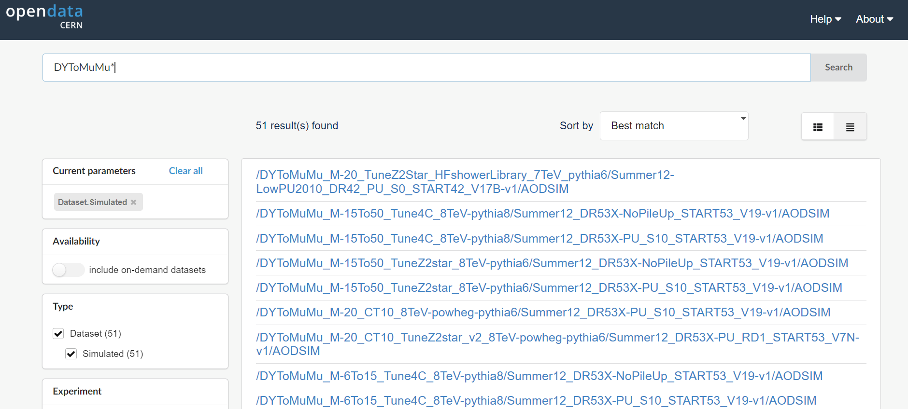

:::::: questions
- What data and run periods are available?
- What data do the collision datasets contain?
- What Monte Carlo samples are available?

::::::

:::::: objectives
- To be able to navigate the CERN Open Data Portal's search tools
- To be able to find what collision data and Monte Carlo datasets there are using these search tools

::::::

## Data and run periods

We make a distinction between *data* which come from the real-life CMS detector
and simulated *Monte Carlo* data. In general, when we say *data*, we mean the real, CMS-detector-created
data.

The data available are from what is known as **Run 1**, spanning 2010-2012, and **Run 2** spanning 2015-2018. The latest data are from 2016 and were release in April 2024. The run
periods each year can also be broken into **A**, **B**, **C**, and so-on, sub-periods and you may see
that in some of the dataset names. 

:::::: prereq
## Make a selection!
If you are coming from the previous page you should have selected **CMS**, **Dataset**, and **2016**. 
::::::::::::

:::::: callout
## CERN Open Data Portal - CMS datasets
Selecting CMS, Dataset, and 2016.

*Your view might look slightly different than this screenshot as the available datasets and tools are regularly updated.*

::::::::::::

When **Dataset** is selected, there are 3 subcategories:

* **Collision** refers to the real data that came off of the CMS detector.
* **Derived** refers to datasets that have been further processed for some specific purpose, such as outreach
and education or the [ispy](https://cms-outreach.github.io/ispy/) event display. 
* **Simulated** refers to Monte Carlo datasets. 

:::::: prereq

## Make a selection!
Let's now select uniquely the **Collision** option under **Dataset**. 
::::::::::::

### Collision data

When you select **Collision** you'll see a lot of datasets with names that may be confusing. 
Let's take a look at two of them and see if we can break down these names.

:::::: callout
## CERN Open Data Portal - Sample CMS collision datasets

[/DoubleEG/Run2016G-UL2016_MiniAODv2-v1/MINIAOD](http://opendata.cern.ch/record/30504)

[/SingleMuon/Run2016H-UL2016_MiniAODv2_NanoAODv9-v1/NANOAOD](http://opendata.cern.ch/record/30563)

::::::::::::

There are three (3) parts to the names, separated by `/`. 

**Dataset name**

*DoubleEG* or *SingleMuon* is the name of the dataset. Events stored in these primary datasets were selected by *triggers* of usually of a same type. For each dataset, the list of triggers is listed in the dataset record. 
<!-- You will learn more about them in the trigger lesson during the workshop, 
but for now,  -->
You can learn more about them in the lesson of [the CMS Open Data workshops](https://cms-opendata-guide.web.cern.ch/cmsOpenData/workshops/), but for now, remind yourself that they
select out some subset of the collisions based on certain criteria in the hardware
or software. 

Some of the dataset names are quite difficult to intuit what they mean. Others should be roughly understandable. For example, 

* **DoubleEG** contains mainly events with at least two electrons (E) or photons (G: gamma) above a certain energy threshold. 
* **SingleMu** contains mainly events with at least one muon above a certain momentum threshold. 
* **MinimumBias** events are taken without any trigger or selection criteria. 

**Run period and processing string**

*Run2016G* and *Run2016H* refer to when the data were taken, and *UL2016_MiniAODv2-v1* and *UL2016_MiniAODv2_NanoAODv9-v1*
when and how
the data were reprocessed. The details are not so important for you because CMS only releases
vetted data. If you were a CMS analyst working on the data as it was being processed, 
you might have to shift your analysis to a different dataset once all calibrations were completed. 

**Data format**

CMS data are stored in different formats:

* **RAW** files contain information directly from the detector in the form of hits from the TDCs/ADCs. 
(TDC refers to to *[Time to Digital Converter](https://en.wikipedia.org/wiki/Time-to-digital_converter)* and 
ADC refers to to *[Analog to Digital Converter](https://en.wikipedia.org/wiki/Analog-to-digital_converter)*. 
Both of these are pieces of electronics which convert signals from the components of the CMS detector to 
digital signals which are then stored for later analysis.)
These files are not a focus of this workshop. 
* **AOD** stands for *Analysis Object Data*. This was the first stage of data where analysts can really start
physics analysis when using Run 1 data.
* **MINIAOD** is a slimmer format of AOD, in use in CMS from Run 2 data on.
* **NANOAOD**  is slimmed-down version of MINIAOD, and, in contrast to all other formats above, does not require CMS-specific software
for analysis.

### Further information

If you click on the link to any of these datasets, you will find even more information, including

* The size of the dataset
* Information on the what is the recommended software release to analyze this dataset
* Information on the available software containers
* How were the data selected including the details of the trigger selection criteria. <!-- More on this in a later lesson. -->
* Validation information
* A list of all the individual ROOT files in which this dataset is stored

There are multiple text files that contain the paths to these ROOT files. If we click on
any one of them, we see something like this. 

:::::: callout

## CERN Open Data Portal - CMS dataset file isting

Sample listing of some of the ROOT files in the 
[/SingleMuon/Run2016H-UL2016_MiniAODv2_NanoAODv9-v1/NANOAOD](https://opendata.cern.ch/record/30563/files/CMS_Run2016H_SingleMuon_NANOAOD_UL2016_MiniAODv2_NanoAODv9-v1_130000_file_index.txt)
dataset.

::::::::::::

The prepended `root:` is because of how these files are accessed. We'll use these directory
paths when we go to inspect some of these files. The grouping of the files in separate lists comes
from the reprocessing computing operations and has no particular meaning.

## Monte Carlo

We can go through a similar exercise with the Monte Carlo data. One major difference is that
the Monte Carlo are not broken up by trigger. Instead, when you analyze the Monte Carlo, you will
apply the trigger to the data to simulate what happens in the real data. <!-- You will learn
more about this in the upcoming trigger exercise.  -->

For now, let's look at some of the Monte Carlo datasets that are available to you. 

:::::: prereq
## Make some selections! But first make some unselections!
Unselect everything except for **2016**, **CMS**, **Dataset**, and then select **Simulated** (under **Dataset**).  

Scroll down to see the options under **Category** in the left bar. 
::::::::::::

:::::: callout
## CERN Open Data Portal - CMS Monte Carlo datasets
Monte Carlo dataset category search options

::::::::::::

There are a lot of Monte Carlo samples! It's up to you to determine which ones 
might contribute to your analysis. The names try to give you some sense of
the primary process, subsequent decays, the collision energy 
and specific simulation software (e.g. Pythia), but if you have questions, 
reach out to the organizers.
<!-- through 
[Mattermost](https://mattermost.web.cern.ch/cmsodws2022/channels/town-square). -->

As with the collision data, here are three (3) parts to the names, separated by `/`. 

Let's look at one of them:
[/DYToMuMu_M-120To200_TuneCP5_13TeV-powheg-pythia8/RunIISummer20UL16NanoAODv9-106X_mcRun2_asymptotic_v17-v1/NANOAODSIM](https://opendata.cern.ch/record/35751)

**Physics process/Monte Carlo sample**

*DYToMuMu_M-120To200_TuneCP5_13TeV-powheg-pythia8* is hard to understand at first glance, but
if we take our time we might be able to intuit some of the meaning. This appears
to simulate a [Drell-Yan process](https://en.wikipedia.org/wiki/Drell%E2%80%93Yan_process) 
in which two quarks interact to produce a virtual photon/Z boson which then couples to 
two leptons. The *M-120To200* refers to a selection that has been imposed requiring the mass of the di-lepton 
pair to be between 120 and 200 50 GeV/c^2. *TuneCP5* refers to the the set of CMS underlying-event parameters of PYTHIA8 event generator. *13TeV* is the center-of-mass energy of the collision used in the simulation, 
the remaining fields tell us what 
software was used to generate this (*powheg* for event generation and *pythia8* for hadronization).

**Processing and Global tag**

*RunIISummer20UL16NanoAODv9-106X_mcRun2_asymptotic_v17-v1* refers to how and when this Monte Carlo was processed. 
The details are not so important for you because the open data coordinators have
taken care to only post vetted data. But it is all part of the data provenance.

**Data format**

The last field refers to the data format and here again there is a slight difference.

* **MINIAODSIM** or **NANOAODSIM** stands for *Mini or Nano Analysis Object Data - Simulation*. This is the same as 
the **MINIAOD** or **NANOAOD** format used in the collision data, except that there are some extra fields that
store information about the original, generated 4-vectors at the parton level, as well
as some other Monte Carlo-specific information. 

One difference is that you will
want to select the Monte Carlo events that pass certain triggers at the time of your analysis, while
that selection was already done in the data by the detector hardware/software itself. 

If you click on any of these fields, you can see more details about the samples, similar
to the collision data. 

## More Monte Carlo samples

If you would like a general idea of what other physics processes have been simulated, you can
check scroll down the sidebar until you come to **Category**. 

:::::: challenge

## Challenge: find generator parameters

Select some Monte Carlo datasets and see if you can find the generator information in the dataset provenance.

::::::::::::

You may have to do a bit of poking around to find the dataset that is most appropriate for what
you want to do, but remember, 
you can always reach out to the organizers.
<!-- through 
[Mattermost](https://mattermost.web.cern.ch/cmsodwswhepp24/channels/town-square). -->

## Search tips

The category search is helpful to find relevant Monte Carlo datasets, but that's not enough! The most recent CMS data release includes more than 40000 Monte Carlo datasets and even split into smaller categories, your category of interest might have several hundred entries.

A help page provides some [search tips](https://opendata.cern.ch/docs/cod-search-tips) and some more here:

For 2016 data, you can select the format that you are going to use and that will half the number of entries. Choose, for example **nanoaodsim** under **File type**.

To fit more entries to one page, you can choose the list view from the search, and increase the number of results per page. It will make the search slower.

To search a string in the record title use, for example:

- `GluGluHToGG*`
- `DYToMuMu*`
- `*sherpa*`
- `*flat*`

:::::: callout

Always check the generator parameters from the dataset provenance to be sure what you get!

::::::::::::

:::::: keypoints
- The collision data are directed to different datasets based on trigger decisions.
- The Monte Carlo datasets contain a specific simulated physics process.
::::::
