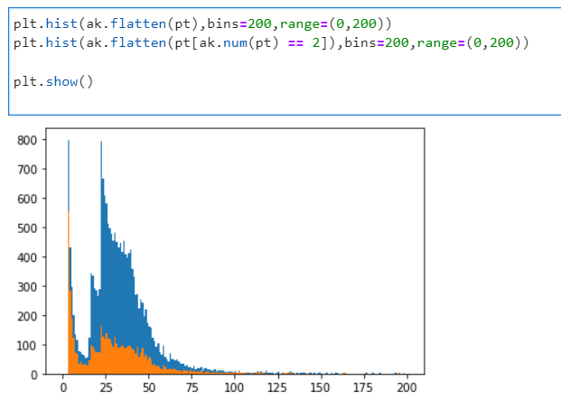

:::::: questions
- How do I inspect these files to see what is in them?

::::::

:::::: objectives
- To be able to see what objects are in the data files

::::::

In the following, we will learn about CMS data in the NANOAOD format. This is the data format
that can be accessed without CMS-specific software using ROOT or python tools.


## NANOAOD variable list

Each NANOAOD dataset has the variable list with a brief description attached to the portal record.

::::::::::::::::::::::::::::::::::::: challenge

### Challenge: variables

Find the variable listings for a collision data record and a Monte Carlo data record. What are the differences? What is the same?

:::::::::::::::: solution

The data records have a "Luminosity" block with some beam related information whereas MC records have a "Runs" block with event generation information.

The MC records have event generator or simulation information in the "Events" block.
 
The variables of reconstructed objects, such as Muons, are the same for [data](https://opendata.cern.ch/eos/opendata/cms/dataset-semantics/NanoAOD/30563/SingleMuon_doc.html#Muon) and [MC](https://opendata.cern.ch/eos/opendata/cms/dataset-semantics/NanoAODSIM/35751/DYToMuMu_M-120To200_TuneCP5_13TeV-powheg-pythia8_doc.html#Muon).

:::::::::::::::::::::::::
:::::::::::::::::::::::::::::::::::::::::::::::

## Inspect datasets with ROOT

This part of the lesson will be done from within the [ROOT tools container](https://cms-opendata-workshop.github.io/workshopqcd-2024-lesson-docker/03-docker-for-cms-opendata.html#root-tools-container). You should have it available, start it with:

```bash
docker start -i my_root
```

All ROOT commands will be typed inside that environment.

If you are using VNC for the graphics, remember to start it before starting ROOT in the container prompt:

```bash
start_vnc
```

Work through the quick introduction to getting started with CMS NANOAOD Open Data in [the getting started guide page](https://opendata.cern.ch/docs/cms-getting-started-nanoaod) on the CERN Open Data portal.

:::::: checklist

### You will learn:

- [x] how to print out the event content of a NANOAOD file in ROOT
- [x] how to plot a variable in the NANOAOD file with some selections in ROOT

::::::::::::


## Inspect datasets with python tools

This part of the lesson will be done from within the [python tools container](https://cms-opendata-workshop.github.io/workshopqcd-2024-lesson-docker/03-docker-for-cms-opendata.html#python-tools-container). You should have it available, start it with:

```bash
docker start -i my_python
```

Start the jupyter lab with

```bash
jupyter-lab --ip=0.0.0.0 --no-browser
```

Open a new jupyter notebook from the jupyter lab tab that the container will open in your browser. 
Type the commands in code cells of the notebook.

First, import some python libraries:

```python
import uproot
import matplotlib.pylab as plt
import awkward as ak
import numpy as np
```

 - [uproot](https://uproot.readthedocs.io/en/latest/index.html) is a python inteface to ROOT
 - [matplotlib](https://matplotlib.org/) can be used for plotting
 - [numpy](https://numpy.org/) is a python package for scientific computing
 - [awkard](https://awkward-array.org/doc/main/) is a python library for variable-size data

Then, open a file from a dataset:

```python
file = uproot.open("root://eospublic.cern.ch//eos/opendata/cms/Run2016H/SingleMuon/NANOAOD/UL2016_MiniAODv2_NanoAODv9-v1/120000/61FC1E38-F75C-6B44-AD19-A9894155874E.root")
```


### Print out event content with python tools

You can check the content blocks of the file with

```python
file.classnames()
```

```output
{'tag;1': 'TObjString',
 'Events;1': 'TTree',
 'LuminosityBlocks;1': 'TTree',
 'Runs;1': 'TTree',
 'MetaData;1': 'TTree',
 'ParameterSets;1': 'TTree'}
```

`Events` is the `TTree`object that contains the variables of interest to us. Get it from the data with:

```python
events = file['Events']
```

You can list the full list of variables with

```python
events.keys()
```

Now, fetch some variables of interest, e.g. take all muon pt values in an array

```python
pt = events['Muon_pt'].array()
```
::::::::::::::::::::::::::::::::::::: challenge

### Challenge: inspect pt

Find out the type of the pt array. Print values of some of its elements. What do you observe?

:::::::::::::::: solution

Find the type with

```python
type(pt)
```

```output
awkward.highlevel.Array
```

Print out some of the values with

```python
print(pt)
```

```output
[[23.1], [39.3], [24.1], [91.9, 52.7], ... [88.7, 14.2], [58.9], [27.1], [50]]
```

Note that the muon pt array can contain one or more elements, depending on the number of reconstructed muons in the event.

From the [awkward array documentation](https://awkward-array.org/doc/main/user-guide/how-to-filter-num.html#use-ak-num), you can find out hot to choose the events with exactly two reconstructed muons:

```python
pt[ak.num(pt) == 2]
```

```output
<Array [[91.9, 52.7], ... [88.7, 14.2]] type='2713 * var * float32'>
```

:::::::::::::::::::::::::
:::::::::::::::::::::::::::::::::::::::::::::::

You can learn about awkward arrays and much more in the [HEP Software Foundation Scikit-HEP tutorial](https://hsf-training.github.io/hsf-training-scikit-hep-webpage/04-awkward/index.html).

### Plot a variable with python tools

Common python plotting tools cannot handle arrays or arrays with different sizes, such as the muon pt. If you want to plot all muon pts, "flatten" the pt array first:

```python
ptflat=ak.flatten(pt)
```

Now plot the muon pt values with

```python
plt.hist(ak.flatten(pt),bins=200,range=(0,200))
plt.show()
```

You could also plot directly `ptflat` variable, but it you want to introduce some cuts that need the knowledge that certain values belong to the same event, you need to do them to the original pt array. For example, plotting the events with 2 muons:

```python
plt.hist(ak.flatten(pt),bins=200,range=(0,200))
plt.hist(ak.flatten(pt[ak.num(pt) == 2]),bins=200,range=(0,200))
plt.show()
```

This is what you will see:



If you've chosen another dataset or another file, it will look different.


:::::: keypoints
- It's useful to inspect the files before diving into the full analysis.
- Some files may not have the information you're looking for.
::::::